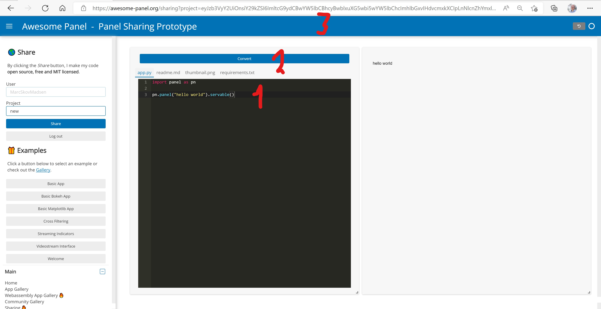

# Panel Sharing: The fastest way to share your data app

Inspiration: https://www.whitphx.info/posts/20221104-streamlit-wasm-stlite/

https://shiny.rstudio.com/py/docs/shinylive.html

[Panel Sharing](https://awesome-panel.org) makes it very easy to share [Panel](https://panel.holoviz.org) data apps with the world

- Go to [Panel Sharing](https://awesome-panel.org)
- Add your code
- Convert the app
- Login to Github
- Share

This is made possible by [`panel convert`](https://panel.holoviz.org/user_guide/Running_in_Webassembly.html) that converts Panel apps to [webassembly](https://webassembly.org/). The Webassembly runtime makes it possible to run your apps offline, on all devices and scale to many users for free.

Please be aware that the panel converted apps downloads a large amount of data and makes all your code readable by other users; **DON'T INCLUDE PASSWORDS AND OTHER SECRETS IN THE CODE!**.

## How to

### Create and share your code and app

Use the description below if you want to share a long link on [Stack Overflow](https://stackoverflow.com/) or [HoloViz Discourse](https://discourse.holoviz.org/) to your code and live app.

1. Open the [sharing gallery](https://awesome-panel.org/sharing_gallery).
2. Add your code to the `app.py` file.
3. Click the *Convert* button and verify that your app works
4. Copy-Paste the long url to share it with the world

Optionally you can add your requirements to the `requirements.txt` file. Most often this is not needed though as `panel convert` inspects your code and adds the requirements automatically.

This link is very long as it contains the content of all your files as a *base64 encoded* string. The advantage of this is that your app is only stored temporarily on the Panel Server while your session is open. You can use an [url shortener](https://www.google.com/search?q=url+shortener+online) or the description below to get a shorter link. 

This will only work for small apps. Please validate your link before sharing. Some browsers support very long links (Chrome) and some don't (Edge).

Example URL: [https://awesome-panel.org/sharing?project=eyJzb3VyY2UiOnsiY29kZSI6ImltcG9ydCBwYW5lbCBhcyBwblxuXG5wbi5wYW5lbChcImhlbGxvIHdvcmxkXCIpLnNlcnZhYmx...](https://awesome-panel.org/sharing?project=eyJzb3VyY2UiOnsiY29kZSI6ImltcG9ydCBwYW5lbCBhcyBwblxuXG5wbi5wYW5lbChcImhlbGxvIHdvcmxkXCIpLnNlcnZhYmxlKCkiLCJyZWFkbWUiOiIjIEludHJvZHVjdGlvblxuXG5UaGUgcHVycG9zZSBvZiB0aGlzIHByb2plY3QgLi4uXG5cbiMjIFJlc291cmNlc1xuXG4tIFtQYW5lbF0oaHR0cHM6Ly9wYW5lbC5ob2xvdml6Lm9yZykgfCBbV2ViQXNzZW1ibHkgVXNlciBHdWlkZV0oaHR0cHM6Ly9wYW5lbC5ob2xvdml6Lm9yZy91c2VyX2d1aWRlL1J1bm5pbmdfaW5fV2ViYXNzZW1ibHkuaHRtbCkgfCBbQ29tbXVuaXR5IEZvcnVtXShodHRwczovL2Rpc2NvdXJzZS5ob2xvdml6Lm9yZy8pIHwgW0dpdGh1YiBDb2RlXShodHRwczovL2dpdGh1Yi5jb20vaG9sb3Zpei9wYW5lbCkgfCBbR2l0aHViIElzc3Vlc10oaHR0cHM6Ly9naXRodWIuY29tL2hvbG92aXovcGFuZWwvaXNzdWVzKSB8IFtUd2l0dGVyXShodHRwczovL21vYmlsZS50d2l0dGVyLmNvbS9wYW5lbF9vcmcpIHwgW0xpbmtlZEluXShodHRwczovL3d3dy5saW5rZWRpbi5jb20vY29tcGFueS83OTc1NDQ1MClcbi0gW0F3ZXNvbWUgUGFuZWxdKGh0dHBzOi8vYXdlc29tZS1wYW5lbC5vcmcpIHwgW0dpdGh1YiBDb2RlXShodHRwczovL2dpdGh1Yi5jb20vbWFyY3Nrb3ZtYWRzZW4vYXdlc29tZS1wYW5lbCkgfCBbR2l0aHViIElzc3Vlc10oaHR0cHM6Ly9naXRodWIuY29tL01hcmNTa292TWFkc2VuL2F3ZXNvbWUtcGFuZWwvaXNzdWVzKVxuLSBNYXJjIFNrb3YgTWFkc2VuIHwgW1R3aXR0ZXJdKGh0dHBzOi8vdHdpdHRlci5jb20vTWFyY1Nrb3ZNYWRzZW4pIHwgW0xpbmtlZEluXShodHRwczovL3d3dy5saW5rZWRpbi5jb20vaW4vbWFyY3Nrb3ZtYWRzZW4vKVxuLSBTb3BoaWEgWWFuZyB8IFtUd2l0dGVyXShodHRwczovL3R3aXR0ZXIuY29tL3NvcGhpYW15YW5nKSB8IFtNZWRpdW1dKGh0dHBzOi8vc29waGlhbXlhbmcubWVkaXVtLmNvbS8pXG4tIFtQeW9kaWRlXShodHRwczovL3B5b2RpZGUub3JnKSB8IFtGQVFdKGh0dHBzOi8vcHlvZGlkZS5vcmcvZW4vc3RhYmxlL3VzYWdlL2ZhcS5odG1sKVxuLSBbUHlTY3JpcHRdKGh0dHBzOi8vcHlzY3JpcHQubmV0LykgfCBbRkFRXShodHRwczovL2RvY3MucHlzY3JpcHQubmV0L2xhdGVzdC9yZWZlcmVuY2UvZmFxLmh0bWwpXG4iLCJyZXF1aXJlbWVudHMiOiIifX0%3D)
### Create and share your app

Use the description below if you want a short, persistent url you can share on for example social media and/ or if you want to contribute your app to the [Panel Sharing Gallery](https://awesome-panel.org/sharing_gallery).  

- Open the [sharing gallery](https://awesome-panel.org/sharing_gallery).
- Add your code to the `app.py` editor tab.
- Click the *convert* button and verify that your app works
- Click the *login* button to log in via Github
- Click the *Share* button
- Click the *Copy* button to copy the link to your app or click the *Open* button to open your app in a new tab.

Optionally you can add your requirements to the `requirements.txt` editor tab. Most often this is not needed though as `panel convert` inspects your code and adds the requirements automatically.

Example URL: [https://awesome-panel.org/sharing?app=MarcSkovMadsen/videostream-interface](https://awesome-panel.org/sharing?app=MarcSkovMadsen/videostream-interface)

### Update and re-share your app

- Open the [sharing gallery](https://awesome-panel.org/sharing_gallery).
- Search and find your app
- Click the code icon

This will open the editor with the code of your app. Now you can **edit and re-share your app**.

### Get a direct link to your app in the editor

After sharing your app, you can just **copy the current link** and save it for future usage.

**Its safe to share this link with the world**; only you will be able to update your app. Others will be able to edit and convert the code as well as share a new app in their own user name.

