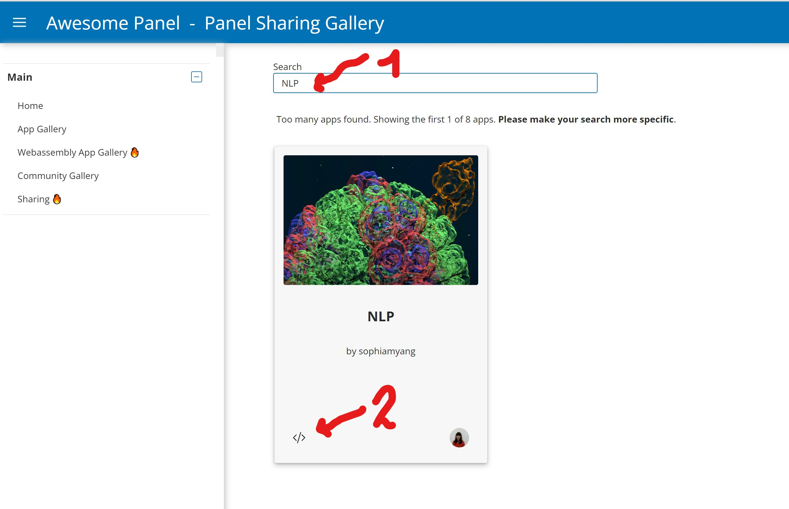
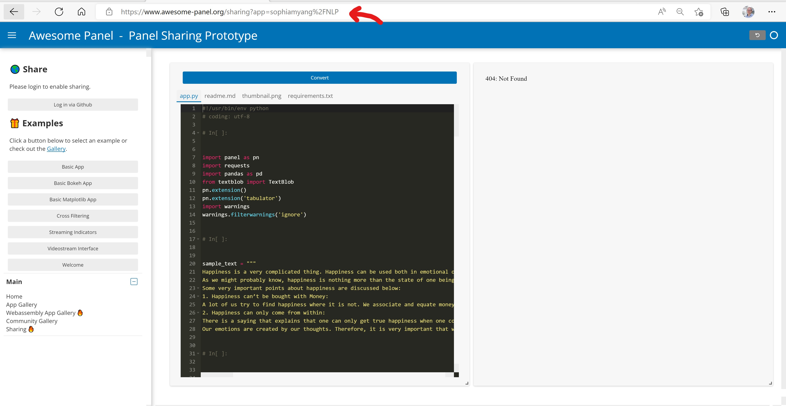

# Panel Sharing: The fastest way to share your data app

Inspiration: https://www.whitphx.info/posts/20221104-streamlit-wasm-stlite/

[Panel Sharing](https://awesome-panel.org) makes it very easy to share [Panel](https://panel.holoviz.org) data apps with the world

- Go to [Panel Sharing](https://awesome-panel.org)
- Add your code
- Convert the app
- Login to Github
- Share

This was made possible by [`panel convert`](https://panel.holoviz.org/user_guide/Running_in_Webassembly.html) that converts Panel apps to [webassembly](https://webassembly.org/).

## How to

### Update and re-share an app

- Open the [sharing gallery](https://awesome-panel.org/sharing_gallery).
- Search and find your app
- Click the code icon

This will open the editor with the code of your app. Now you can **edit and re-share your app**.

### Get a direct link to your app in the editor

After sharing your app, you can just **copy the current link** and save it for future usage.

**Its safe to share this link with the world**; only you will be able to update your app. Others will be able to edit and convert the code as well as share a new app in their own user name.

