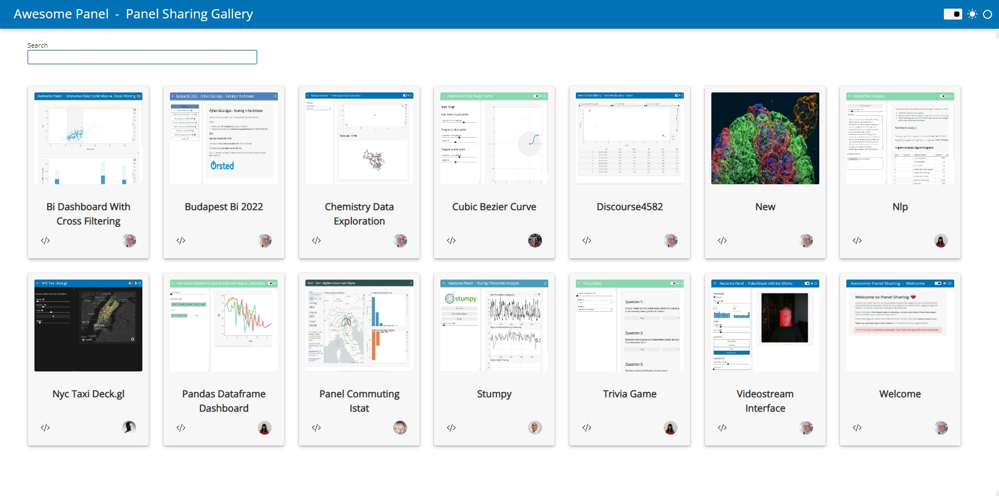
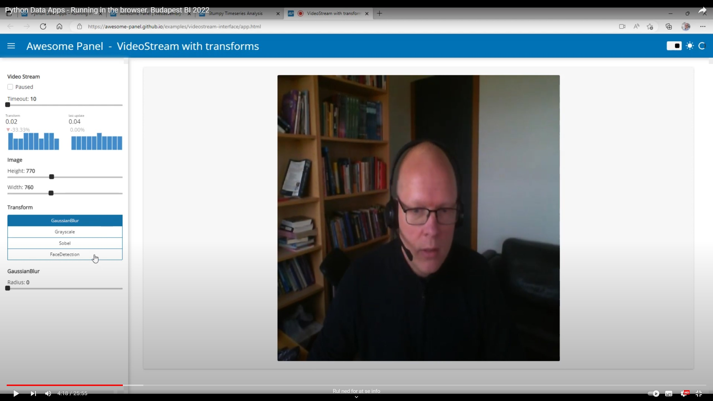
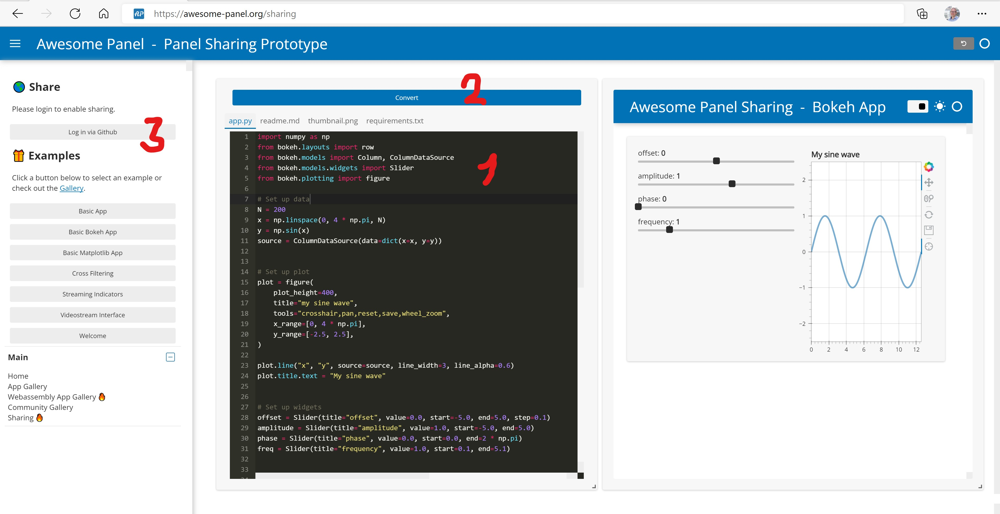
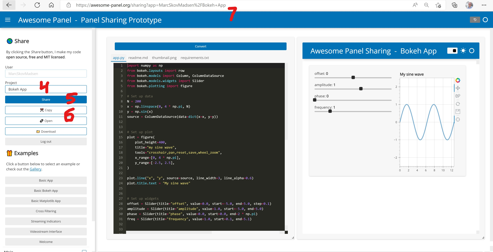
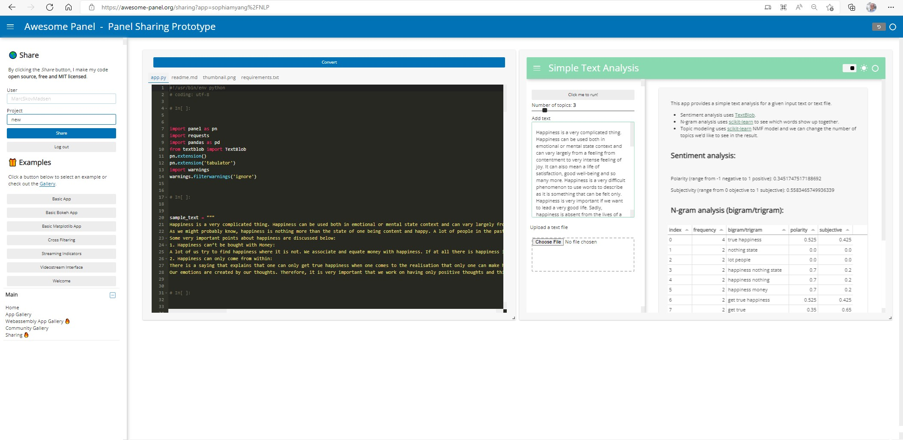
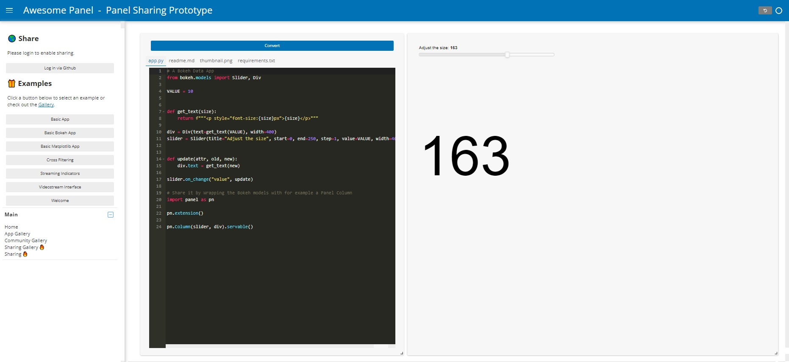
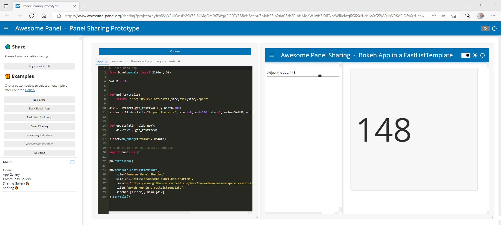

# Panel Sharing: The fastest way to share your data app

[Panel Sharing](https://awesome-panel.org) is **the fastest way to share [Bokeh](https://docs.bokeh.org/en/latest/) and [Panel](https://panel.holoviz.org) data apps** with the world.

To **get started in less than a minute** go to [Awesome Panel Sharing](https://awesome-panel.org/sharing) and

1. Add your code
2. Convert the app
3. Share your app

[](https://awesome-panel.org/sharing)

You and our community can now find your app in the [Gallery](https://awesome-panel.org/sharing_gallery).

[](https://awesome-panel.org/sharing_gallery)

For more details check out the [How to Guides](#how-to) below.

## How it works

This is made possible by [`panel convert`](https://panel.holoviz.org/user_guide/Running_in_Webassembly.html) that converts Panel apps to [webassembly](https://webassembly.org/). The Webassembly runtime makes it possible to run your apps in the browser only. NO SERVER REQUIRED. It works online+offline, on all devices and scales to many, many users for free.

For more inspiration and details check out [my talk from Budapest BI Forum 2022](https://youtu.be/mlRwn5GSD40).

[](https://youtu.be/mlRwn5GSD40)

Please be aware that 

- **the apps downloads a large amount of data** and makes all your code readable by other users; **DON'T INCLUDE PASSWORDS OR OTHER SECRETS IN YOUR CODE!**.
- You can only convert applications that imports packages installed on the server. You can check out what is installed in this [pyproject.toml](https://github.com/awesome-panel/awesome-panel/blob/master/pyproject.toml) file (Look in the `project.optional-dependencies` section). You can request your dependencies added [here](https://github.com/awesome-panel/awesome-panel/issues).

## How to

- [Create and share your app](#create-and-share-your-app)
- [Update and re-share your app](#update-and-re-share-your-app)
- [Create and share small code and app examples](#create-and-share-small-code-and-app-examples)
- [Prepare your Bokeh app for sharing](#prepare-your-bokeh-app-for-sharing)

### Create and share your app

Use the description below if you want a short, persistent url you can share on for example social media and/ or if you want to contribute your app to the [Panel Sharing Gallery](https://awesome-panel.org/sharing_gallery).  

Open the [sharing gallery](https://awesome-panel.org/sharing_gallery) and

1. Add your code to the `app.py` editor tab.
2. Click the *convert* button and verify that your app works
3. Click the *login* button to log in via Github



4. Give your app a nice name
5. Click the *Share* button
6. Click the *Copy* button to copy the link to your app or click the *Open* button to open your app in a new tab.
7. Optionally copy the url in the browser if you want a direct link to your app in the editor.



Optionally you can add your requirements to the `requirements.txt` editor tab. Most often this is not needed though as `panel convert` inspects your code and adds the requirements automatically.

App Example URL: [https://sharing.awesome-panel.org/MarcSkovMadsen/videostream-interface/app.html](https://sharing.awesome-panel.org/MarcSkovMadsen/videostream-interface/app.html)

Editor Example URL: [https://awesome-panel.org/sharing?app=MarcSkovMadsen/videostream-interface](https://awesome-panel.org/sharing?app=MarcSkovMadsen/videostream-interface)

### Update and re-share your app

Open the [sharing gallery](https://awesome-panel.org/sharing_gallery)

1. Search and find your app
2. Click the code icon

[](https://awesome-panel.org/sharing_gallery)

This will open the editor with the code of your app. Now you can **edit and re-share your app**.

[](https://awesome-panel.org/sharing?app=sophiamyang%2FNLP)

Example Editor Url: [https://awesome-panel.org/sharing?app=sophiamyang%2FNLP](https://awesome-panel.org/sharing?app=sophiamyang%2FNLP)

Please note that **after the app is re-shared it might take from seconds to a
couple of minutes before the app is updated**. The technical reason is that it needs to *[purge](https://learn.microsoft.com/en-us/azure/cdn/cdn-purge-endpoint)* the files on a CDN.

### Create and share small code and app examples

Use the description below if you want to share a small code sample and live app on [Stack Overflow](https://stackoverflow.com/) or [HoloViz Discourse](https://discourse.holoviz.org/).

Open the [sharing gallery](https://awesome-panel.org/sharing_gallery) and

1. Add your code to the `app.py` file.
2. Click the *Convert* button and verify that your app works
3. Copy-Paste the long url to share it with the world


Optionally you can add your requirements to the `requirements.txt` file. Most often this is not needed though as `panel convert` inspects your code and adds the requirements automatically.

This link is very long as it contains the content of all your files as a *base64 encoded* string. The advantage of this is that your app is only stored temporarily on the Panel Server while your session is open. You can use an [url shortener](https://www.google.com/search?q=url+shortener+online) or the description below to get a shorter link. 

This will only work for small apps. Please validate your link before sharing. Some browsers support very long links (Chrome) and some don't (Edge).

Editor Example URL: [https://awesome-panel.org/sharing?project=eyJzb3VyY2UiOnsiY29kZSI6ImltcG9ydCBwYW5lbCBhcyBwblxuXG5wbi5wYW5lbChcImhlbGxvIHdvcmxkXCIpLnNlcnZhYmx...](https://awesome-panel.org/sharing?project=eyJzb3VyY2UiOnsiY29kZSI6ImltcG9ydCBwYW5lbCBhcyBwblxuXG5wbi5wYW5lbChcImhlbGxvIHdvcmxkXCIpLnNlcnZhYmxlKCkiLCJyZWFkbWUiOiIjIEludHJvZHVjdGlvblxuXG5UaGUgcHVycG9zZSBvZiB0aGlzIHByb2plY3QgLi4uXG5cbiMjIFJlc291cmNlc1xuXG4tIFtQYW5lbF0oaHR0cHM6Ly9wYW5lbC5ob2xvdml6Lm9yZykgfCBbV2ViQXNzZW1ibHkgVXNlciBHdWlkZV0oaHR0cHM6Ly9wYW5lbC5ob2xvdml6Lm9yZy91c2VyX2d1aWRlL1J1bm5pbmdfaW5fV2ViYXNzZW1ibHkuaHRtbCkgfCBbQ29tbXVuaXR5IEZvcnVtXShodHRwczovL2Rpc2NvdXJzZS5ob2xvdml6Lm9yZy8pIHwgW0dpdGh1YiBDb2RlXShodHRwczovL2dpdGh1Yi5jb20vaG9sb3Zpei9wYW5lbCkgfCBbR2l0aHViIElzc3Vlc10oaHR0cHM6Ly9naXRodWIuY29tL2hvbG92aXovcGFuZWwvaXNzdWVzKSB8IFtUd2l0dGVyXShodHRwczovL21vYmlsZS50d2l0dGVyLmNvbS9wYW5lbF9vcmcpIHwgW0xpbmtlZEluXShodHRwczovL3d3dy5saW5rZWRpbi5jb20vY29tcGFueS83OTc1NDQ1MClcbi0gW0F3ZXNvbWUgUGFuZWxdKGh0dHBzOi8vYXdlc29tZS1wYW5lbC5vcmcpIHwgW0dpdGh1YiBDb2RlXShodHRwczovL2dpdGh1Yi5jb20vbWFyY3Nrb3ZtYWRzZW4vYXdlc29tZS1wYW5lbCkgfCBbR2l0aHViIElzc3Vlc10oaHR0cHM6Ly9naXRodWIuY29tL01hcmNTa292TWFkc2VuL2F3ZXNvbWUtcGFuZWwvaXNzdWVzKVxuLSBNYXJjIFNrb3YgTWFkc2VuIHwgW1R3aXR0ZXJdKGh0dHBzOi8vdHdpdHRlci5jb20vTWFyY1Nrb3ZNYWRzZW4pIHwgW0xpbmtlZEluXShodHRwczovL3d3dy5saW5rZWRpbi5jb20vaW4vbWFyY3Nrb3ZtYWRzZW4vKVxuLSBTb3BoaWEgWWFuZyB8IFtUd2l0dGVyXShodHRwczovL3R3aXR0ZXIuY29tL3NvcGhpYW15YW5nKSB8IFtNZWRpdW1dKGh0dHBzOi8vc29waGlhbXlhbmcubWVkaXVtLmNvbS8pXG4tIFtQeW9kaWRlXShodHRwczovL3B5b2RpZGUub3JnKSB8IFtGQVFdKGh0dHBzOi8vcHlvZGlkZS5vcmcvZW4vc3RhYmxlL3VzYWdlL2ZhcS5odG1sKVxuLSBbUHlTY3JpcHRdKGh0dHBzOi8vcHlzY3JpcHQubmV0LykgfCBbRkFRXShodHRwczovL2RvY3MucHlzY3JpcHQubmV0L2xhdGVzdC9yZWZlcmVuY2UvZmFxLmh0bWwpXG4iLCJyZXF1aXJlbWVudHMiOiIifX0%3D)

### Prepare your Bokeh app for sharing

In order to be able to [Create and share your app](#create-and-share-your-app), you need to wrap your Bokeh models in [Panels `Bokeh` Pane](https://panel.holoviz.org/reference/panes/Bokeh.html), a [Panel layout](https://panel.holoviz.org/reference/index.html#layouts) like [`pn.Column`](https://panel.holoviz.org/reference/layouts/Column.html), a [Panel Template](https://panel.holoviz.org/user_guide/Templates.html) or just `pn.panel`.

Wrapping it in `pn.Column` could look like this

```python
# A Bokeh Data App
from bokeh.models import Slider, Div

VALUE = 10


def get_text(size):
    return f"""<p style="font-size:{size}px">{size}</p>"""

div = Div(text=get_text(VALUE), width=400)
slider = Slider(title="Adjust the size", start=0, end=250, step=1, value=VALUE, width=400,)


def update(attr, old, new):
    div.text = get_text(new)

slider.on_change("value", update)

# Share it by wrapping the Bokeh models with for example a Panel Column
import panel as pn

pn.extension()

pn.Column(slider, div).servable()
```

[](https://www.awesome-panel.org/sharing?project=eyJzb3VyY2UiOnsiY29kZSI6IiMgQSBCb2tlaCBEYXRhIEFwcFxyXG5mcm9tIGJva2VoLm1vZGVscyBpbXBvcnQgU2xpZGVyLCBEaXZcclxuXHJcblZBTFVFID0gMTBcclxuXHJcblxyXG5kZWYgZ2V0X3RleHQoc2l6ZSk6XHJcbiAgICByZXR1cm4gZlwiXCJcIjxwIHN0eWxlPVwiZm9udC1zaXplOntzaXplfXB4XCI%2Be3NpemV9PC9wPlwiXCJcIlxyXG5cclxuZGl2ID0gRGl2KHRleHQ9Z2V0X3RleHQoVkFMVUUpLCB3aWR0aD00MDApXHJcbnNsaWRlciA9IFNsaWRlcih0aXRsZT1cIkFkanVzdCB0aGUgc2l6ZVwiLCBzdGFydD0wLCBlbmQ9MjUwLCBzdGVwPTEsIHZhbHVlPVZBTFVFLCB3aWR0aD00MDAsKVxyXG5cclxuXHJcbmRlZiB1cGRhdGUoYXR0ciwgb2xkLCBuZXcpOlxyXG4gICAgZGl2LnRleHQgPSBnZXRfdGV4dChuZXcpXHJcblxyXG5zbGlkZXIub25fY2hhbmdlKFwidmFsdWVcIiwgdXBkYXRlKVxyXG5cclxuIyBTaGFyZSBpdCBieSBXcmFwcGluZyB0aGUgQm9rZWggbW9kZWxzIHdpdGggZm9yIGV4YW1wbGUgYSBQYW5lbCBDb2x1bW5cclxuaW1wb3J0IHBhbmVsIGFzIHBuXHJcblxyXG5wbi5leHRlbnNpb24oKVxyXG5cclxucG4uQ29sdW1uKHNsaWRlciwgZGl2KS5zZXJ2YWJsZSgpIiwicmVxdWlyZW1lbnRzIjoiIn19)

Wrapping it in a nice [FastListTemplate](https://panel.holoviz.org/user_guide/Templates.html) could look like this.

```python
# Bokeh Data App
from bokeh.models import Slider, Div

VALUE = 10


def get_text(size):
    return f"""<p style="font-size:{size}px">{size}</p>"""

div = Div(text=get_text(VALUE), width=400)
slider = Slider(title="Adjust the size", start=0, end=250, step=1, value=VALUE, width=400,)


def update(attr, old, new):
    div.text = get_text(new)

slider.on_change("value", update)

# Wrap it in a Panel FastListTemplate
import panel as pn

pn.extension()

pn.template.FastListTemplate(
    site="Awesome Panel Sharing",
    site_url="https://awesome-panel.org/sharing",
    favicon="https://raw.githubusercontent.com/MarcSkovMadsen/awesome-panel-assets/320297ccb92773da099f6b97d267cc0433b67c23/favicon/ap-1f77b4.ico",
    title="Bokeh App in a FastListTemplate",
    sidebar=[slider], main=[div]
).servable()
```

[](https://www.awesome-panel.org/sharing?project=eyJzb3VyY2UiOnsiY29kZSI6IiMgQSBCb2tlaCBEYXRhIEFwcFxyXG5mcm9tIGJva2VoLm1vZGVscyBpbXBvcnQgU2xpZGVyLCBEaXZcclxuXHJcblZBTFVFID0gMTBcclxuXHJcblxyXG5kZWYgZ2V0X3RleHQoc2l6ZSk6XHJcbiAgICByZXR1cm4gZlwiXCJcIjxwIHN0eWxlPVwiZm9udC1zaXplOntzaXplfXB4XCI%2Be3NpemV9PC9wPlwiXCJcIlxyXG5cclxuZGl2ID0gRGl2KHRleHQ9Z2V0X3RleHQoVkFMVUUpLCB3aWR0aD00MDApXHJcbnNsaWRlciA9IFNsaWRlcih0aXRsZT1cIkFkanVzdCB0aGUgc2l6ZVwiLCBzdGFydD0wLCBlbmQ9MjUwLCBzdGVwPTEsIHZhbHVlPVZBTFVFLCB3aWR0aD00MDAsKVxyXG5cclxuXHJcbmRlZiB1cGRhdGUoYXR0ciwgb2xkLCBuZXcpOlxyXG4gICAgZGl2LnRleHQgPSBnZXRfdGV4dChuZXcpXHJcblxyXG5zbGlkZXIub25fY2hhbmdlKFwidmFsdWVcIiwgdXBkYXRlKVxyXG5cclxuIyBTaGFyZSBpdCBieSBXcmFwcGluZyB0aGUgQm9rZWggbW9kZWxzIHdpdGggZm9yIGV4YW1wbGUgYSBQYW5lbCBDb2x1bW5cclxuaW1wb3J0IHBhbmVsIGFzIHBuXHJcblxyXG5wbi5leHRlbnNpb24oKVxyXG5cclxucG4uQ29sdW1uKHNsaWRlciwgZGl2KS5zZXJ2YWJsZSgpIiwicmVxdWlyZW1lbnRzIjoiIn19)

Check out these examples for more inspiration

- Basic Bokeh App in `Column`: [Code](https://www.awesome-panel.org/sharing?project=eyJzb3VyY2UiOnsiY29kZSI6IiMgQSBCb2tlaCBEYXRhIEFwcFxyXG5mcm9tIGJva2VoLm1vZGVscyBpbXBvcnQgU2xpZGVyLCBEaXZcclxuXHJcblZBTFVFID0gMTBcclxuXHJcblxyXG5kZWYgZ2V0X3RleHQoc2l6ZSk6XHJcbiAgICByZXR1cm4gZlwiXCJcIjxwIHN0eWxlPVwiZm9udC1zaXplOntzaXplfXB4XCI%2Be3NpemV9PC9wPlwiXCJcIlxyXG5cclxuZGl2ID0gRGl2KHRleHQ9Z2V0X3RleHQoVkFMVUUpLCB3aWR0aD00MDApXHJcbnNsaWRlciA9IFNsaWRlcih0aXRsZT1cIkFkanVzdCB0aGUgc2l6ZVwiLCBzdGFydD0wLCBlbmQ9MjUwLCBzdGVwPTEsIHZhbHVlPVZBTFVFLCB3aWR0aD00MDAsKVxyXG5cclxuXHJcbmRlZiB1cGRhdGUoYXR0ciwgb2xkLCBuZXcpOlxyXG4gICAgZGl2LnRleHQgPSBnZXRfdGV4dChuZXcpXHJcblxyXG5zbGlkZXIub25fY2hhbmdlKFwidmFsdWVcIiwgdXBkYXRlKVxyXG5cclxuIyBTaGFyZSBpdCBieSBXcmFwcGluZyB0aGUgQm9rZWggbW9kZWxzIHdpdGggZm9yIGV4YW1wbGUgYSBQYW5lbCBDb2x1bW5cclxuaW1wb3J0IHBhbmVsIGFzIHBuXHJcblxyXG5wbi5leHRlbnNpb24oKVxyXG5cclxucG4uQ29sdW1uKHNsaWRlciwgZGl2KS5zZXJ2YWJsZSgpIiwicmVxdWlyZW1lbnRzIjoiIn19)
- Basic Bokeh App in `FastListTemplate`: [Code](https://www.awesome-panel.org/sharing?project=eyJzb3VyY2UiOnsiY29kZSI6IiMgQm9rZWggRGF0YSBBcHBcclxuZnJvbSBib2tlaC5tb2RlbHMgaW1wb3J0IFNsaWRlciwgRGl2XHJcblxyXG5WQUxVRSA9IDEwXHJcblxyXG5cclxuZGVmIGdldF90ZXh0KHNpemUpOlxyXG4gICAgcmV0dXJuIGZcIlwiXCI8cCBzdHlsZT1cImZvbnQtc2l6ZTp7c2l6ZX1weFwiPntzaXplfTwvcD5cIlwiXCJcclxuXHJcbmRpdiA9IERpdih0ZXh0PWdldF90ZXh0KFZBTFVFKSwgd2lkdGg9NDAwKVxyXG5zbGlkZXIgPSBTbGlkZXIodGl0bGU9XCJBZGp1c3QgdGhlIHNpemVcIiwgc3RhcnQ9MCwgZW5kPTI1MCwgc3RlcD0xLCB2YWx1ZT1WQUxVRSwgd2lkdGg9NDAwLClcclxuXHJcblxyXG5kZWYgdXBkYXRlKGF0dHIsIG9sZCwgbmV3KTpcclxuICAgIGRpdi50ZXh0ID0gZ2V0X3RleHQobmV3KVxyXG5cclxuc2xpZGVyLm9uX2NoYW5nZShcInZhbHVlXCIsIHVwZGF0ZSlcclxuXHJcbiMgV3JhcCBpdCBpbiBhIFBhbmVsIEZhc3RMaXN0VGVtcGxhdGVcclxuaW1wb3J0IHBhbmVsIGFzIHBuXHJcblxyXG5wbi5leHRlbnNpb24oKVxyXG5cclxucG4udGVtcGxhdGUuRmFzdExpc3RUZW1wbGF0ZShcclxuICAgIHNpdGU9XCJBd2Vzb21lIFBhbmVsIFNoYXJpbmdcIixcclxuICAgIHNpdGVfdXJsPVwiaHR0cHM6Ly9hd2Vzb21lLXBhbmVsLm9yZy9zaGFyaW5nXCIsXHJcbiAgICBmYXZpY29uPVwiaHR0cHM6Ly9yYXcuZ2l0aHVidXNlcmNvbnRlbnQuY29tL01hcmNTa292TWFkc2VuL2F3ZXNvbWUtcGFuZWwtYXNzZXRzLzMyMDI5N2NjYjkyNzczZGEwOTlmNmI5N2QyNjdjYzA0MzNiNjdjMjMvZmF2aWNvbi9hcC0xZjc3YjQuaWNvXCIsXHJcbiAgICB0aXRsZT1cIkJva2VoIEFwcCBpbiBhIEZhc3RMaXN0VGVtcGxhdGVcIixcclxuICAgIHNpZGViYXI9W3NsaWRlcl0sIG1haW49W2Rpdl1cclxuKS5zZXJ2YWJsZSgpIiwicmVxdWlyZW1lbnRzIjoiIn19)
- Bokeh Reference Example: [Code](https://www.awesome-panel.org/sharing?example=Basic+Bokeh+App)
- Stumpy: [App](https://sharing.awesome-panel.org/seanlaw/stumpy/app.html), [Code](https://www.awesome-panel.org/sharing?app=seanlaw/stumpy)
